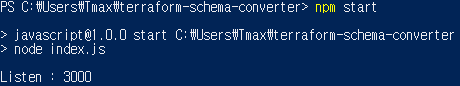
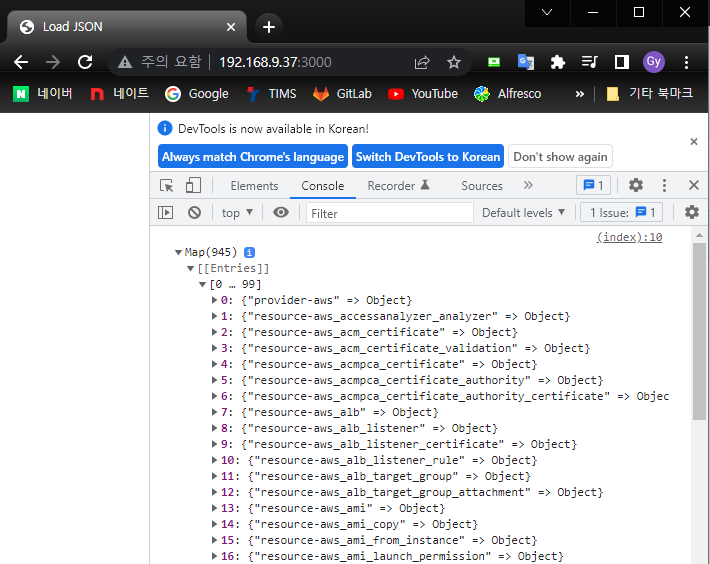

# terraform-schema-converter

## Prerequisites
* 필수 모듈
  * [NodeJS](https://nodejs.org/ko/)

## Step 1. terraform schema file 설정
* public/json/terraform_schema.json 위치에 해당 테라폼 스키마 파일 위치
* 해당 스키마 파일은 테라폼 명령을 통해 추출 가능 (https://www.terraform.io/cli/commands/providers/schema 참고)

## Step 2. npm server 기동
* 해당 루트 디렉토리에서 npm server 프로세스를 실행

## Step 3. 파싱 데이터 확인
* 브라우저 상에서 해당 서버로 접근하여 파싱된 데이터 확인

